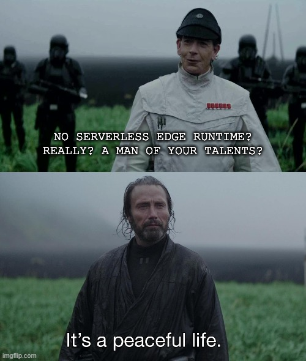

# The Art of Simple (But Thriving) Side Projects 🚀

## Background

In today's tech landscape, we're often bombarded with endless integrations and coupling across frameworks, cloud providers, managed databases, and SaaS products.

The purpose of this template is to demonstrate how to kickstart a side project with **minimal integrations**, freeing ourselves from the _"freemium entanglement"_ that often accompanies modern web development.

This project is built with the **following philosophy** in mind:

> Fall in love with the problem, not the solution.

This means focusing on solving the problem at hand, rather than getting bogged down by the tools we use. Our goal is to get things up and running quickly, allowing us to concentrate on the issues we're passionate about.



## Design Principles

To achieve this, we've established a set of basic design principles:

- **Single Codebase**: Everything should be contained within a single codebase.
- **Easy Data Management**: Data should be straightforward to manage and migrate.
- **Maintainability and Extensibility**: The project doesn't have to be perfect, but it should be easy to maintain and extend.
- **Simple Deployment**: It should be easy to deploy, even from a Raspberry Pi.
- **Focused on Side Projects**: It doesn't need to scale horizontally; this is a side project, after all.
- **Rich in Features**: Simple does not mean basic; it should remain feature-rich.
- **Minimal External Dependencies**: We should avoid depending on external services unless they are crucial to the project.
- **Performance with Simplicity**: It should be performant, but not at the expense of simplicity.

By adhering to these principles, we aim to build side projects that are not only effective but also enjoyable to develop and maintain.

## Table of Contents

- [Background](#background)
- [Design Principles](#design-principles)
- [Key Choices](#key-choices)
    - [Golang](#golang)
    - [Vertical Scaling](#vertical-scaling)
    - [Pocketbase](#pocketbase)
    - [Cloudflare Tunnel](#cloudflare-tunnel)
    - [Other Cool Additions](#other-cool-additions)
- [Getting Started](#getting-started)
    - [Project Structure](#project-structure)
    - [Prerequisites](#prerequisites)
    - [Dependencies](#dependencies)
    - [Getting Started](#getting-started)
- [Development Workflow](#development-workflow)
    - [Live Reload](#live-reload)
    - [Compile Tailwind and Templ Manually](#compile-tailwind-and-templ-manually)
    - [Docker](#docker)
- [Cloudflare Tunnel](#cloudflare-tunnel)
- [Data Migrations](#data-migrations)
- [Contributing](#contributing)

## Key choices

### Golang

Golang was an easy choice for me. It's what I call "the good kind of boring". It's simple, fast, and easy to deploy, perfect for focusing on the problem and not letting the technology get in the way.

### Vertical Scaling

Most SaaS offerings out there make the promise of a free tier with horizontal scaling. But let's be honest, we're really just binding ourselves to their platform, for something we likely don't need.

I truly think people underestimate how far vertical scaling, with good old caching, can take you. This project is built with that in mind.

### Pocketbase

Alongside that, I decided to use [Pocketbase](https://pocketbase.io/) as the backbone of this project. Pocketbase is a simple, fast, and easy-to-use CMS that can be used [as a framework](https://pocketbase.io/docs/use-as-framework). It is extremely lightweight and allows you to build a backend and database in a single file.

It comes out of the box with:
- Rest APIs
- Database (let's go Sqlite!)
- Admin Panel
- Users and Permissions
- Real-time updates
- Emails
- Automatic migrations
- Event hooks
- And so much more

### Cloudflare Tunnel

I wanted to make it easy to deploy this project from anywhere, even from a Raspberry Pi, and to use a CDN to limit the load on the server. That's how I landed on [Cloudflare Tunnels](https://www.cloudflare.com/products/tunnel/), a secure way to expose your local server to the internet (with caching!)

I am aware it technically goes against the "minimal external dependencies" principle, but I believe it's a good trade-off for the simplicity and ease of deployment. Also it doesn't intrude in the codebase itself, it's simply a line in the Docker Compose file.

### Other cool additions

- **Tailwind CSS**: Utility-first CSS framework for styling.
- **htmx**: Enhances HTML with AJAX, CSS Transitions, WebSockets, and Server-Sent Events.
- **Alpine.js**: Lightweight JavaScript framework for handling UI components.
- **Docker Compose**: Simplifies deployment and environment configuration (optional).
- **Air**: Provides live reload for development.

## Getting started

### Project Structure

- **Pages**: Located in `internal/views/pages`.
- **Components**: Located in `internal/views/components`.
- **Fragments**: Located in `internal/views/fragments`. Fragments are small pieces of HTML that can be returned for usage with htmx.
- **Layouts**: Located in `internal/views/layouts`.
- **Router Configuration**: Configure routes in `internal/core/router`.

### Prerequisites

- Golang
- Tailwind CSS (can be installed as a standalone binary or via Node.js)
- Docker (optional)
- Docker Compose (optional)

### Dependencies

- **Tailwind CSS**: Used for styling. [Tailwind Installation Guide](https://tailwindcss.com/docs/installation)
  - Can be installed via npm/yarn or as a standalone binary.
- **Templ**: A Golang templating language that compiles to Go functions. [Templ Guide](https://templ.guide)
- **Air**: Used for live reloading during development.

### Getting Started

1. **Clone the Repository**:
    ```sh
    git clone https://github.com/yourusername/go-fullstack.git
    cd go-fullstack
    ```

2. **Install Dependencies**:
    ```sh
    make tidy
    ```

3. **Build the Project**:
    ```sh
    make build
    ```

4. **Run the Application**:
    ```sh
    make serve
    ```

### Development Workflow

To streamline your development workflow, you can use the following commands:

#### Live Reload

Air provides live reloading during development. To start the development server with live reload, you will have to install Air first:

```sh
go install github.com/a-h/templ/cmd/templ@latest
```

and then run:

```sh
make dev
```

#### Compile Tailwind and Templ manually

The build step will always compile Tailwind and Templ for you.

You shouldn't need to run this command yourself, but if needed you can use the following commands:

```sh
make tailwind
```

```sh
make templ
```

#### Docker

To deploy the application, use Docker Compose which is configured to set the ENV variable to prod by default.

```sh
docker-compose up -d
```

## Cloudflare tunnel

This project was designed as a sample for a fast and easy deployment. By design we decided to use Cloudflare tunnel to expose the local server to the internet. This is configured in the `docker-compose.yml` file.

In theory, you could run this from home :)

## Data migrations

The project supports "auto migrations" from Pocketbase if the `ENV` environment variable is set to `dev`. This feature allows you to modify records in the Pocketbase admin and automatically generate migration files in `internal/migrations`.

**Note**: The `ENV` variable defaults to `dev`. Ensure to set it to `prod` when releasing. Docker Compose does this for you by default.

Migrations will run automatically when the application starts. If you want to run migrations manually, you can use the following command:

```sh
make migrate
```

## Contributing

Contributions are welcome! Please fork the repository and submit a pull request.
